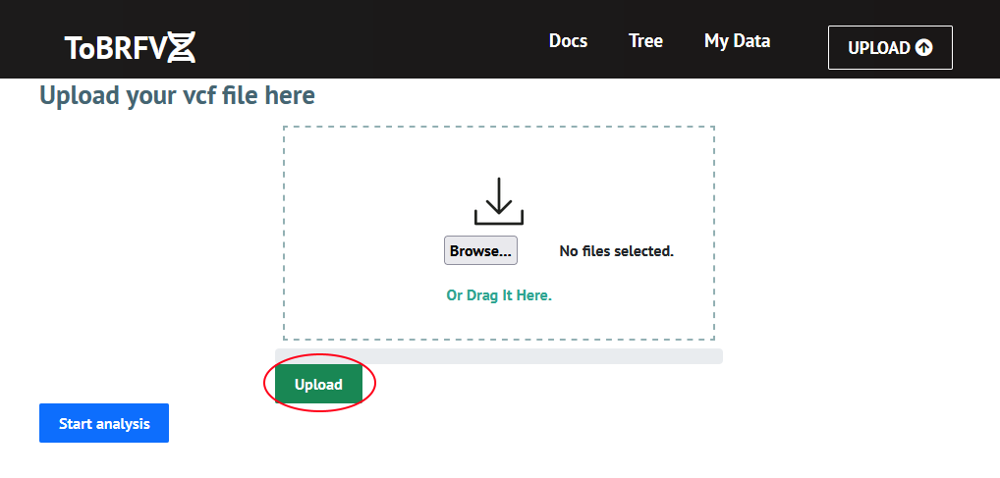
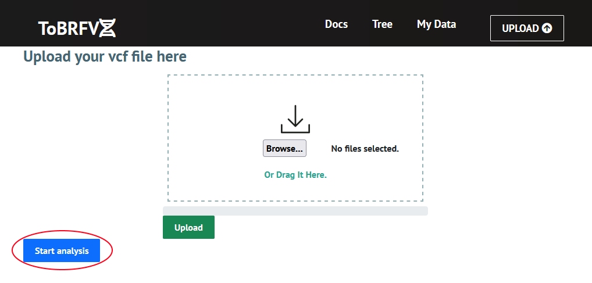
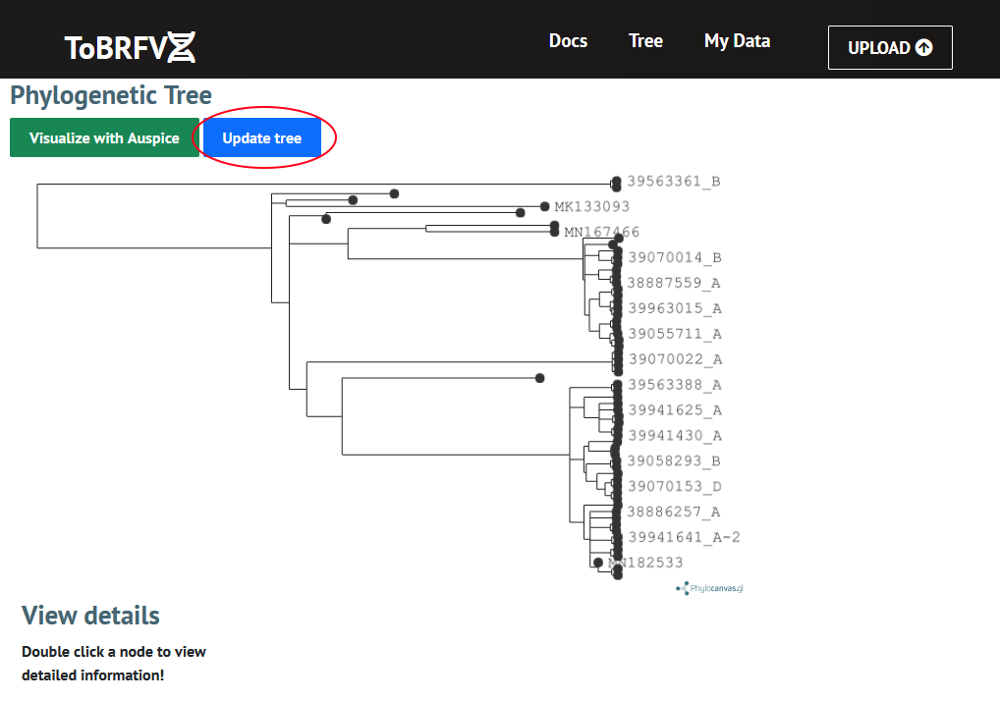
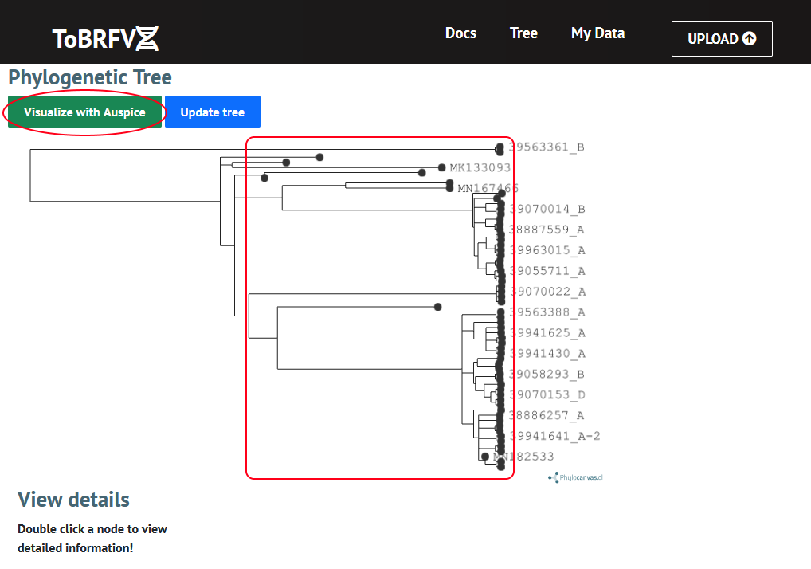
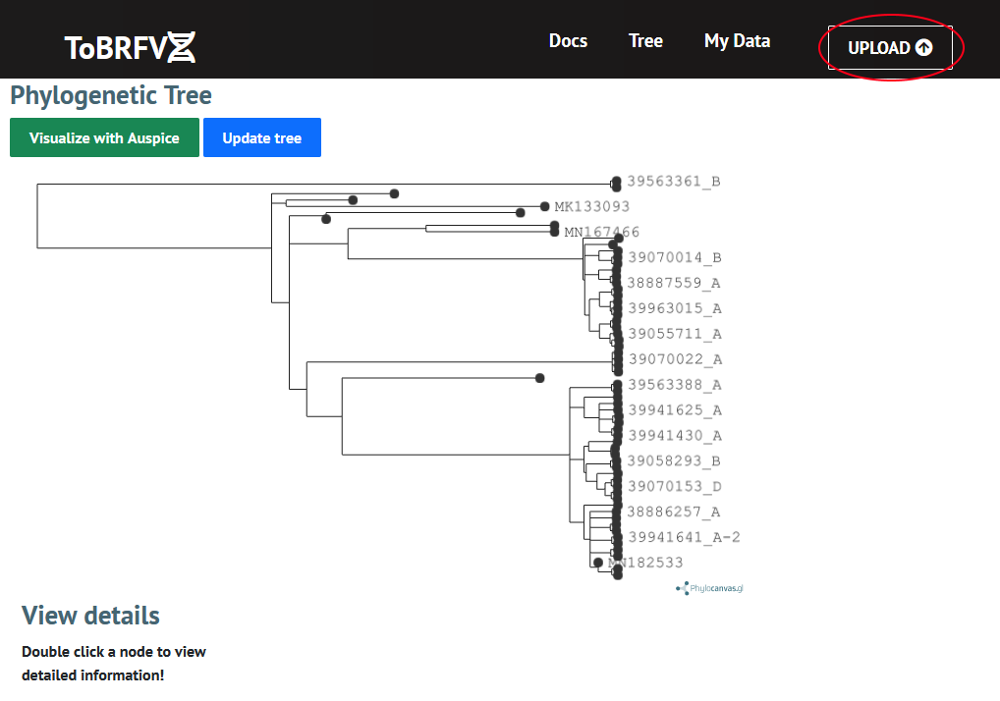

# Welcome to ToBRFV-Lineages!

#### To assign and visualize the lineage for a given genom of the Tomato Brown Rugose Fruit Virus (ToBRFV), follow these steps:

#### 1) Upload your file

Upload the DNA sequence in a 'vcf' file by either dragging and dropping the file into the window or by browsing for a file, then click 'Upload'

#### 2) Start analysis

Once the file has successfully uploaded, click the 'Start analysis' button

#### 3) Update the tree

Once analysis is complete, go to the tree page and click 'Update tree'

#### 4) Review the results

Double click on a node of the phylogenetic tree for more information. An interactive visualization of the phylogenomic data can be launched by clicking 'Visualize with [Auspice](https://docs.nextstrain.org/projects/auspice/en/stable/)'.

#### 5) Upload more files

You can upload more files by going back to the upload page

